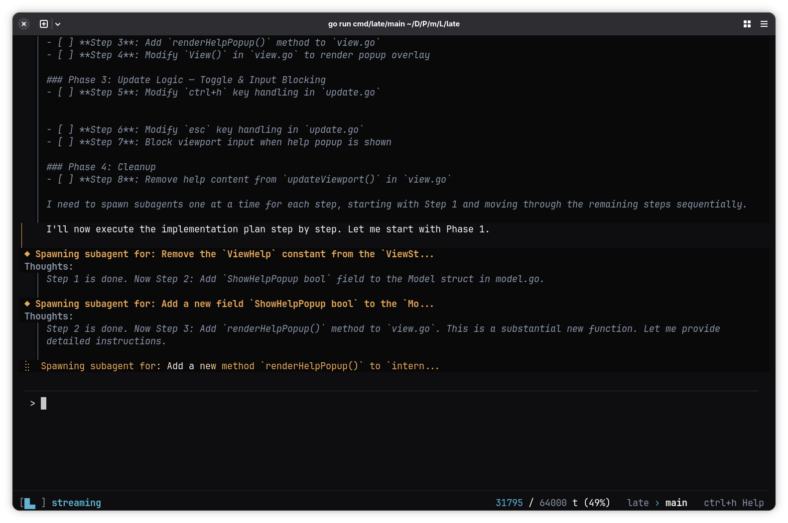

<h1 align="center">Late</h1>

<p align="center">
  <a href="README.md">English</a> | <a href="README.zh-CN.md">简体中文</a>
</p>

<p align="center">
  <b>Stop degrading your model's reasoning.</b><br><br>
  A minimal, zero-config AI coding agent.<br>
  Enforced ephemeral subagents retain model intelligence and keep context pure.<br>
  From tiny local models up to Sol, Fable, and Kimi K3.<br>
Get real work done with any LLM.
</p>

<p align="center">
  <a href="https://github.com/mlhher/homebrew-late"></a>
  <a href="https://github.com/mlhher/late-cli/releases"></a>
  <a href="https://deepwiki.com/mlhher/late-cli"></a>
</p>

> [Outperforming Claude Code and Codex for Local LLM Workflows](https://agentnativedev.medium.com/outperforming-claude-code-and-codex-for-local-llm-workflows-5de0e2b1add5) — Agent Native
>
> *"Late-CLI is mindblowing... I'm shocked that the token usage is so minimal, I keep expecting a big bill from DeepSeek's API."* — GitHub Discussions
>
> *"The same model feels smarter with Late."* — Reddit
>
> **Built with Late:** Late is primarily developed inside Late itself.

<div align="center">
  <br/>
  
  <br/>
  <i>Late Orchestrator forming a plan and spawning atomic subagents for surgical edits.</i>
  <br/><br/>
</div>

## 10-Second Quickstart

A single, statically compiled binary. Zero dependencies. No Python venvs, no NodeJS.

```bash
# macOS / Linux (Homebrew)
brew tap mlhher/late && brew install late

# Universal Fallback (Linux / macOS / Windows WSL)
curl -sfL https://raw.githubusercontent.com/mlhher/late-cli/main/install.sh | bash

# Run instantly in any project
cd your-project
late
```

*(Arch Linux: `yay -S late-cli-bin` | [Manual Binaries (incl. native Windows)](https://github.com/mlhher/late-cli/releases))*

## The Architectural Bottleneck

**The Problem:** Standard coding agents try to do everything inside a single, shared context window. Every compile error, lint failure, and even file write piles up in the KV cache. As the context fills with garbage, the model's intelligence actively degrades. You blame the model, but it's an architecture failure.

**The Late Solution:** Late splits the brain. It enforces a strict boundary between planning and execution and actively compartmentalizes agents identities and objectives.

```text
                              [ User Prompt ]
                                    │
                                    ▼
┌──────────────────────────────────────────────────────────────────┐
│    MAIN ORCHESTRATOR (~1,000 Token System Prompt)                │
│ Always planning. Analyzes intent, maps layout, forms master plan.│
│ Context window remains 100% pure (Signal Only).                  │
└──────┬────────────────────────────────────────────────────┬──────┘
       │ (Spawns)                                           │ (Spawns)
       ▼                                                    ▼
┌────────────────────────────────┐           ┌────────────────────────────────┐
│ EPHEMERAL SUBAGENT: Coding     │           │ EPHEMERAL SUBAGENT: Research   │
│ - Executes exact-match diffs   │           │ - Scrapes & synthesizes data   │
│ - Absorbs lint/write/retry     │           │ - Absorbs raw data bloat       │
└──────────────┬─────────────────┘           └────────────────┬───────────────┘
               │                                              │
               ▼                                              ▼
      [ CONTEXT DESTROYED ]                          [ CONTEXT DESTROYED ]
               │                                              │
               └───────────► [ Returns Outcomes ] ◄───────────┘
                                      │
                                      ▼
                    ( 🔄 Orchestrator plans & continues )

```

The orchestrator’s context grows only from what actually matters: your exact instructions and the definitive results. Everything the subagent did to get there is wiped from memory. **The same model feels smarter in Late because it reasons purely from signal, never noise.**

## The Feature Matrix

|  | Late | Claude Code | OpenCode | The Weekly Clone |
| --- | --- | --- | --- | --- |
| **Workflow** | **Autonomous Orchestration** | Manual toggling | Manual toggling | Blind execution/Manual toggling |
| **Implementations** | **Ephemeral coder subagents (Wiped)** | Floods main context | Floods main context | Floods main context window |
| **Research / Exploration** | **Ephemeral researcher subagents (Wiped)** | Floods main context | Floods main context | Floods main context window |
| **KV-Cache** | **Ruthless KV-cache management (No prompt-reprocessing)** | Brute-force dumping | Brute-force dumping | Brute-force context dumping |
| **System Prompt** | **~1,000 tokens (Always planning)** | 10,000+ tokens | 10,000+ tokens | ~300-1000+ tokens (No workflow) |
| **Dependencies** | **Zero-dependency static binary** | Node.js | Node.js | Python / Node.js |
| **Setup Required** | **None (OOTB `llama-server` support)** | Anthropic OAuth | Mandatory JSON tweaks | Endless YAML/TOML configs |
| **Built For** | **Builders wanting 10x throughput** | Enterprise expense accounts | Tinkering with settings | Chasing GitHub stars |


## Model Connectivity

Late is hardware and model-agnostic.

**Local Models (Zero Config):**
Works out-of-the-box. Late targets `llama.cpp` on port `:8080` (the default for `llama-server`) with zero configuration required.

**Cloud Providers (DeepSeek, Claude, GPT, Kimi, GLM, OpenRouter):**

```bash
export OPENAI_BASE_URL="your-api-url"
export OPENAI_API_KEY="your-api-key"
export OPENAI_MODEL="model-name"
```


📖 **[Read the Quickstart Guide](./docs/quickstart.md)** to find out how to persist these settings and for MCP setup, Agent Skills, Git Worktrees, Keybindings and more.

## More Features

* **Hybrid Model Routing:** Architect the plan with a massive reasoning model (e.g., GPT 5.6, Kimi K3, GLM 5.2), then automatically spawn subagents to execute the implementation using fast, cheap local models (e.g., Gemma 4).
* **Exact-Match Diffs:** Strict `search`/`replace` blocks with autonomous self-healing on mismatch. Edits fail loud. We never silently corrupt your files.
* **Agent Skills Support:** Extend Late's capabilities by using third party Agent Skills. No configuration required.
* **MCP Integration:** Natively map external Model Context Protocol servers directly into Late via standard I/O.
* **Context-Aware Search:** Native search tool that automatically respects `.gitignore` and `.llmignore` to prevent flooding the context window with irrelevant files.
* **Stateful Resilience:** The Orchestrator maintains continuous session history on disk. Close your terminal, reboot your machine, and pick up exactly where you left off.
* **Git Worktree Support:** Run independent, parallel agent instances across multiple branches without context bleeding.
* **Human-in-the-Loop:** Read-only commands are auto-approved for velocity. Mutations hard-stop for `[y/N]`. Features Session, Project, and Global trust scopes with TTL decay.

## License

Built to create engineering leverage, not to supply free infrastructure for AI startups.

* **Free for Builders:** Use Late freely to write code for any project, including commercial ones. Your generated output is yours.
* **Commercial Infrastructure:** You may not monetize Late itself. Wrapping the orchestration engine into a paid service requires a commercial agreement. *(Converts to GPLv2 on Feb 21, 2030).*